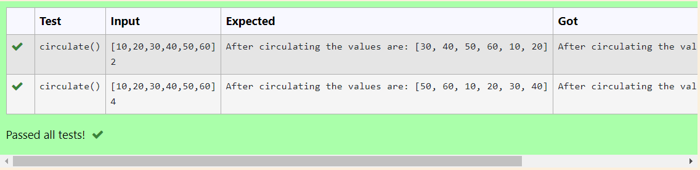

# Circulate-the-values-of-N-variables
## Aim:
To write a python program to circulate the n variables using function concept
## Equipment’s required:
PC
Anaconda - Python 3.7
## Algorithm: 
Step 1:
Get the values from the user

Step 2:
Assign the value of variable to a temporary variable

Step 3:
Get the value from the user for the number of rotation

Step 4:
Using the slicing concept rotate the list

Step 5:
Print both the values it would be interchanged

Step 6:
End the program
## Program:
```
#Program to circulate N values.
#Developed by: Sabeeha Shaik
#RegisterNumber: 23012003
def circulate():
    list = eval(input())
    n=int(input())
    result=list[n:]+list[:n]
    print("After circulating the values are:", result)
```

## Output:


## Result:
The output for circulate the values of n variables is successful.
